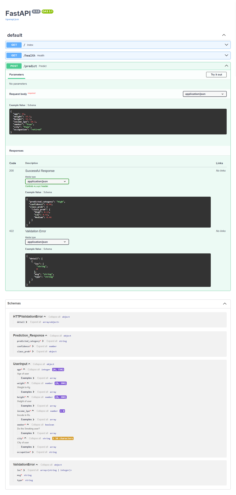

# 🚀 Insurance Premium Prediction API

A FastAPI-based machine learning project that predicts insurance premiums based on user details such as age, weight, height, income, smoking status, city, and occupation. Powered by a trained ML model and robust input validation with Pydantic.

---

## ✨ Features

- **Accurate Premium Prediction:** Uses a pre-trained model (`model.pkl`) to estimate insurance premiums.
- **User Input Validation:** Ensures data integrity with Pydantic models (`user_inputs.py`).
- **Easy Integration:** RESTful API endpoints for seamless integration with web or mobile apps.
- **Customizable:** Easily extendable for new features or additional input fields.

---

## 🖼️ Screenshot

---

## 📦 Project Structure

---

## ⚙️ Installation

1. **Clone the repository:**
git clone https://github.com/onkarshinde77/Fast-API-Project
cd Fast-API-Project
2. **Install dependencies:**
pip install -r requirements.txt
---
## 🚦 Usage
1. **Start the FastAPI server:**
cd FastAPI
uvicorn app:app --reload
2. **Send a POST request to `/docs` endpoint** and send the data in this format:
{
  "age": 30,
  "weight": 70.0,
  "height": 1.75,
  "annual_income": 10.0,
  "is_smoker": false,
  "city": "Mumbai",
  "occupation": "Engineer"
}
3. **The API will return the predicted insurance premium:**
{
  "predicted_category": "high",
  "confidence": 0.46,
  "class_prob": {
    "class_prob": {
      "High": 0.12,
      "Low": 0.42,
      "Medium": 0.46
    }
  }
}

## 👤 Author
Onkar Shinde
- **Your Name**  
- [GitHub](https://github.com/onkarshinde77/Fast-API-Project)
- [Linkedin](https://www.linkedin.com/in/onkar-shinde77/)
---